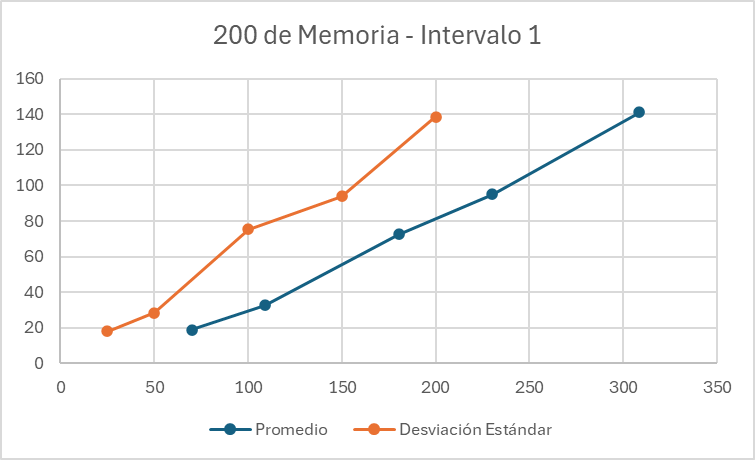
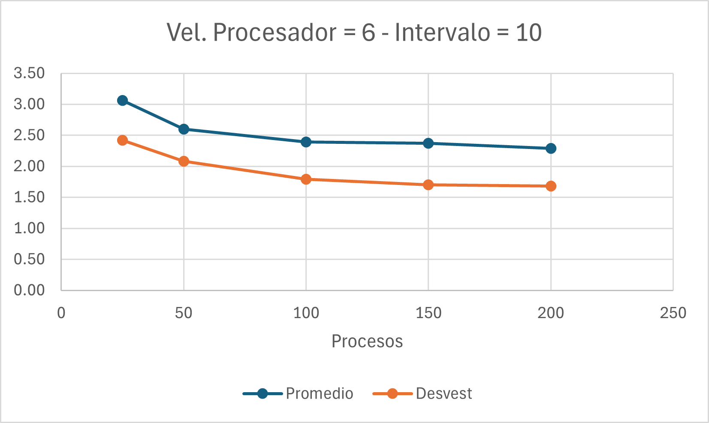
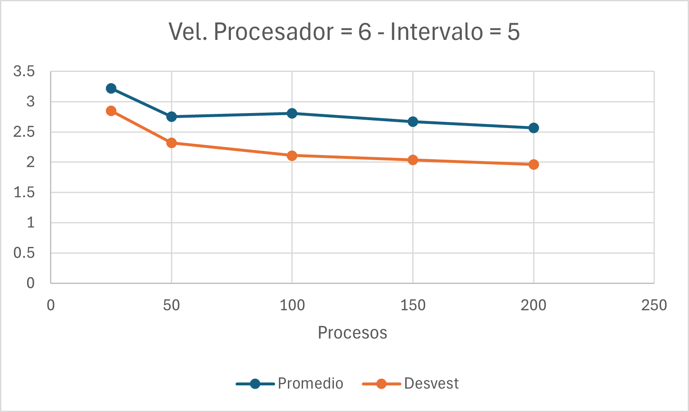
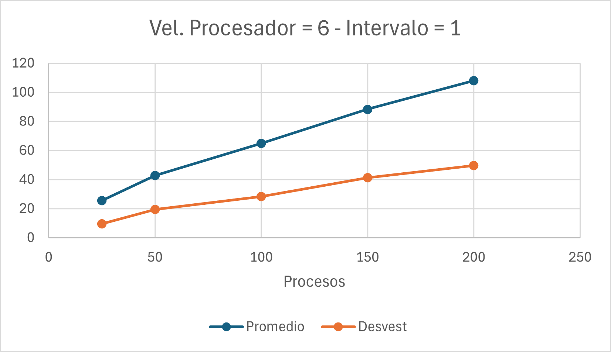
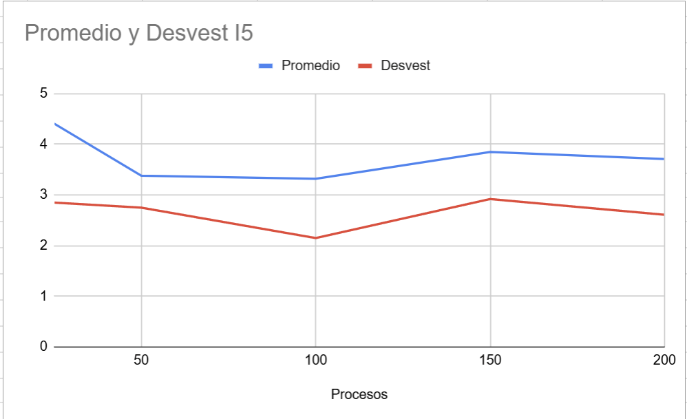
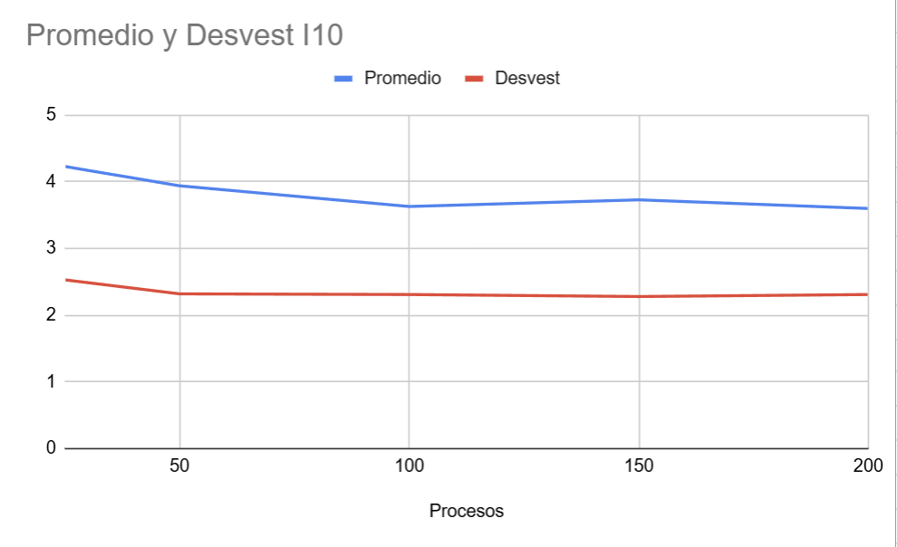

# hdt5
En este proyecto se busca simular como trabaja un CPU por medio de una aplicación de colas
Se graficaran los tiempos en los que terminan para poder determinar cual es la mejor estrategia para reducir tiempos de ejecución
## 🚀 Instalación
1. Clonar el repositorio:
   ```bash
   git clone https://github.com/eldmark/hdt5.git
   cd hdt5

## Requisitos
 1. Python 3.19.9 o superior

## Tablas de Valores
https://docs.google.com/spreadsheets/d/1Gfg2hg_Z6IBcI0oMsNR6PYcb4vd5LAyb1vGnVOYTfB4/edit?usp=sharing

## Graficas
Valores Estándar - Intervalo 10


Valores Estándar - Intervalo 5


Valores Estándar - Intervalo 1


200 de Memoria - Intervalo 10


200 de Memoria - Intervalo 5


200 de Memoria - Intervalo 1



Velocidad 6 de Procesador - Intervalo 10


Velocidad 6 de Procesador - Intervalo 5


Velocidad 6 de Procesador - Intervalo 1



2 Procesadores - Intervalo 1


2 Procesadores - Intervalo 5



2 Procesadores - Intervalo 10



## ¿Cuál es la mejor estrategia para reducir el tiempo promedio de ejecución de los procesos?
- Según las pruebas, el rendimiento varía según la cantidad de tareas asignadas. En primer lugar, la memoria RAM no influye significativamente en el desempeño si el procesador es deficiente, ya que, aunque haya suficiente memoria, los procesos simplemente se acumulan sin poder ser ejecutados eficientemente.  

Por otro lado, mejorar la velocidad del procesador genera una diferencia notable, llegando en algunos casos a triplicar la eficiencia cuando se manejan pocos datos y el tiempo de transmisión de información es moderado. En contraste, el uso de un procesador doble implementa una estrategia de "divide y vencerás", lo que le permite gestionar grandes volúmenes de datos en un corto periodo de tiempo. Sin embargo, su rendimiento resulta mediocre en comparación con las pruebas en las que se optó por aumentar la velocidad del procesador.
