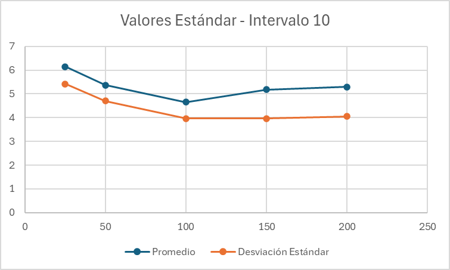
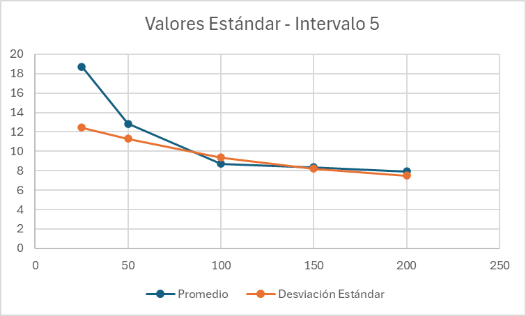
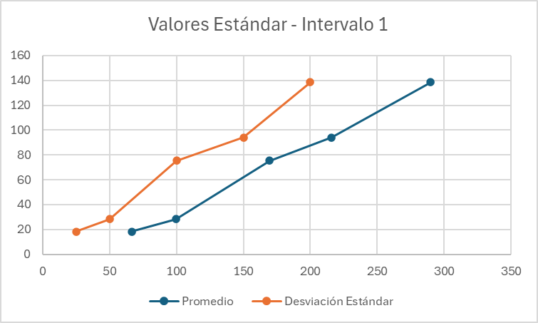

# hdt5
En este proyecto se busca simular como trabaja un CPU por medio de una aplicación de colas
Se graficaran los tiempos en los que terminan para poder determinar cual es la mejor estrategia para reducir tiempos de ejecución
## 🚀 Instalación
1. Clonar el repositorio:
   ```bash
   git clone https://github.com/eldmark/hdt5.git
   cd hdt5

## Requisitos
 1. Python 3.19.9 o superior

## Graficas
Valores Estándar - Intervalo 10

Valores Estándar - Intervalo 5

Valores Estándar - Intervalo 1


200 de Memoria - Intervalo 10

200 de Memoria - Intervalo 5

200 de Memoria - Intervalo 1


Velocidad 6 de Procesador - Intervalo 10

Velocidad 6 de Procesador - Intervalo 5

Velocidad 6 de Procesador - Intervalo 1


2 Procesadores - Intervalo 10

2 Procesadores - Intervalo 5

2 Procesadores - Intervalo 1


## ¿Cuál es la mejor estrategia para reducir el tiempo promedio de ejecución de los procesos_
