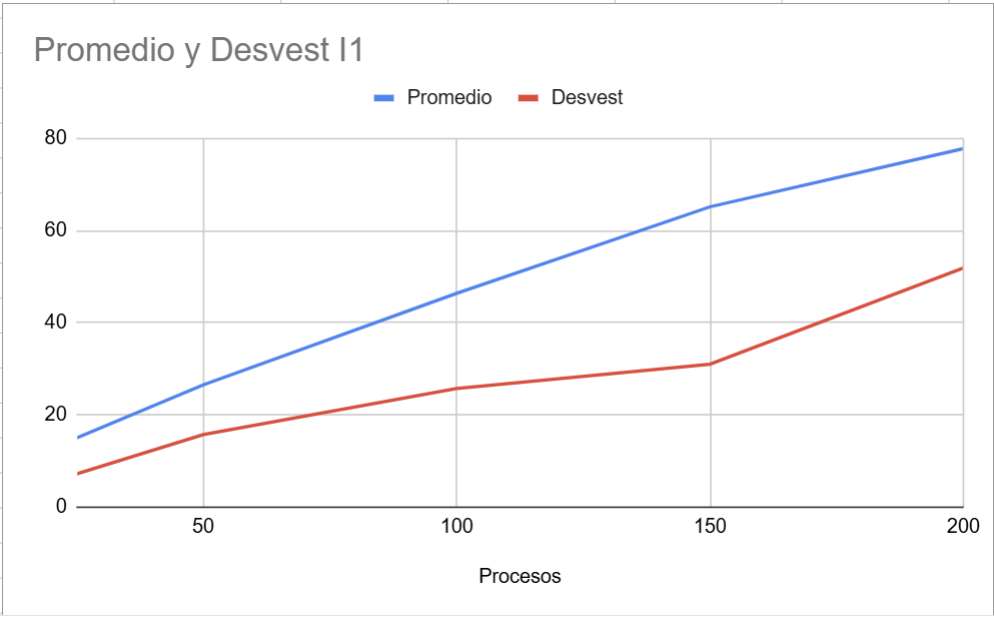

# hdt5
En este proyecto se busca simular como trabaja un CPU por medio de una aplicación de colas
Se graficaran los tiempos en los que terminan para poder determinar cual es la mejor estrategia para reducir tiempos de ejecución
## 🚀 Instalación
1. Clonar el repositorio:
   ```bash
   git clone https://github.com/eldmark/hdt5.git
   cd hdt5

## Requisitos
 1. Python 3.19.9 o superior

## Tablas de Valores
https://docs.google.com/spreadsheets/d/1Gfg2hg_Z6IBcI0oMsNR6PYcb4vd5LAyb1vGnVOYTfB4/edit?usp=sharing

## Graficas
Valores Estándar - Intervalo 10


Valores Estándar - Intervalo 5


Valores Estándar - Intervalo 1


200 de Memoria - Intervalo 10


200 de Memoria - Intervalo 5


200 de Memoria - Intervalo 1


Velocidad 6 de Procesador - Intervalo 10


Velocidad 6 de Procesador - Intervalo 5


Velocidad 6 de Procesador - Intervalo 1


2 Procesadores - Intervalo 1


2 Procesadores - Intervalo 5


2 Procesadores - Intervalo 10


## 쮺uál es la mejor estrategia para reducir el tiempo promedio de ejecución de los procesos?
